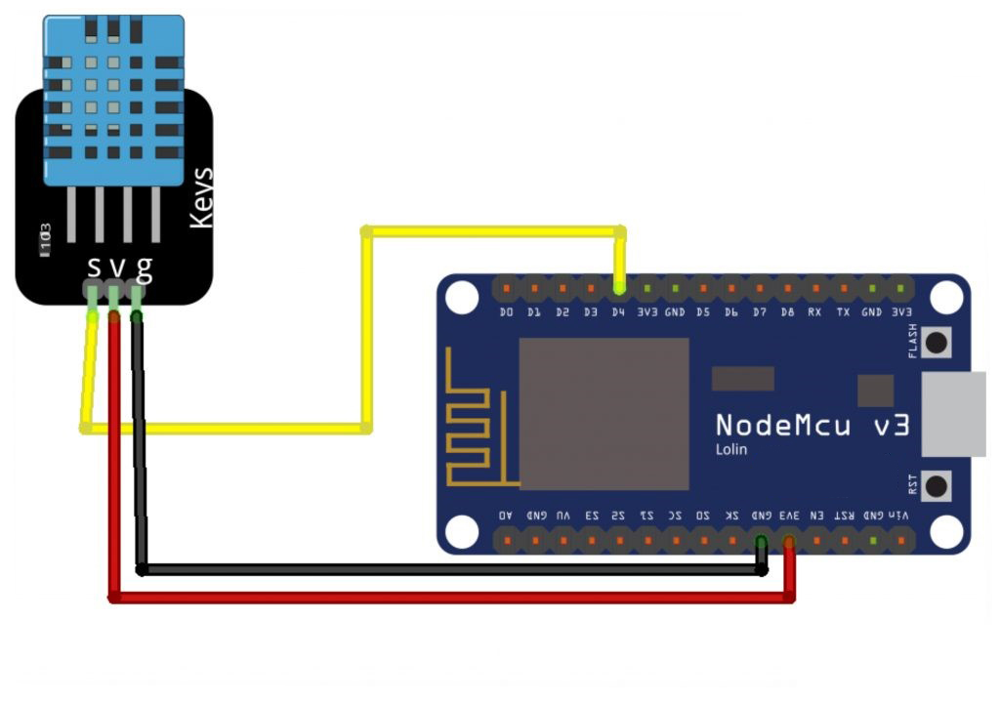
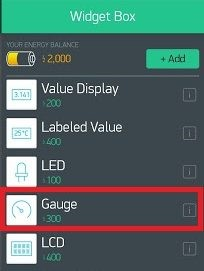
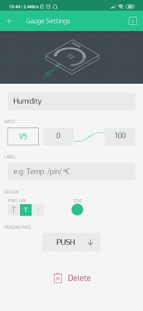
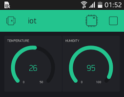

# IoT Projects: Blynk Temperature and Humidity Monitoring

## Description

- This project uses NodeMCU ESP8266 and the DHT11 sensor to monitor environmental conditions such as temperature and humidity. The sensor data is transmitted via Wi-Fi to the Blynk app, allowing users to monitor real-time data remotely. The Blynk interface displays temperature on Virtual Pin V6 and humidity on Virtual Pin V5, providing a user-friendly way to track environmental changes.

- The DHT11 sensor is a sensor module that functions to detect temperature and humidity that has an analog voltage output that can be further processed using a microcontroller. If this DHT11 sensor is connected to an IoT device, the data obtained can be processed and displayed anywhere.

## Components (Tools & Materials)

- NodeMCU ESP8266 (1 unit)
- DHT11 Temperature & Humidity Sensor (1 unit)
- Breadboard and jumper wires

## Circuit Schematic



## Blynk Setup

1. Add the **LCD Widget** to your Blynk app.<br/>

- Use the Gauge type Widget Box.<br/>
  <br>
  Widget Box Gauge selection image<br/>

2. Configure **Virtual Pin V5** for humidity and **Virtual Pin V6** for temperature.<br/>

- Setting pin V6 for gauge setting temperature.<br>
  <br/>
  Image of Temperature Gauge Settings<br/>

- Setting pin V5 for humidity setting gauge.<br/>
  
  Humidity Gauge Setting Image<br/>

3. Make sure your NodeMCU is connected to the Wi-Fi network for real-time data transmission.<br/>

## Code Explanation

- **Wi-Fi & Blynk Setup:**

  - `char auth[]`: Stores the Blynk authentication token.
  - `char ssid[]`: Stores the Wi-Fi network name (SSID).
  - `char pass[]`: Stores the Wi-Fi password.

- **DHT11 Sensor:**

  - Connected to digital pin D2 on NodeMCU.
  - Measures temperature and humidity.

- **Blynk Virtual Pins:**

  - Humidity data is sent to Virtual Pin V5.
  - Temperature data is sent to Virtual Pin V6.

- **Timer:**
  - Data is updated every second using `BlynkTimer`.

## Sketch Code

```cpp
#define BLYNK_PRINT Serial
#include <ESP8266WiFi.h>
#include <BlynkSimpleEsp8266.h>
#include <DHT.h>

char auth[] = "XXXX";           // Blynk authentication token
char ssid[] = "Veendy-Suseno";  // Wi-Fi SSID
char pass[] = "Admin12345";     // Wi-Fi password

#define DHTPIN 2                // DHT11 connected to pin D2
#define DHTTYPE DHT11           // DHT11 type
DHT dht(DHTPIN, DHTTYPE);
BlynkTimer timer;

void sendSensor() {
    float h = dht.readHumidity();
    float t = dht.readTemperature();
    if (isnan(h) || isnan(t)) {
        Serial.println("Failed to read from DHT sensor!");
        return;
    }
    Blynk.virtualWrite(V5, h);
    Blynk.virtualWrite(V6, t);
}

void setup() {
    Serial.begin(9600);
    Blynk.begin(auth, ssid, pass);
    dht.begin();
    timer.setInterval(1000L, sendSensor);
}

void loop() {
    Blynk.run();
    timer.run();
}
```

## Interface:

<br/>
BLYNK Temperature and Humidity Monitoring interface image <br/>

## Conclusion:

- This project offers a simple and effective way to monitor environmental conditions remotely using the Blynk app and NodeMCU. It is ideal for IoT-based temperature and humidity monitoring, providing real-time data to users anywhere via the Blynk interface.

- In this project, NodeMCU is connected to the Blynk application wirelessly used to monitor temperature using the DHT11 sensor. In the Blynk application there is a designation of temperature and humidity.
